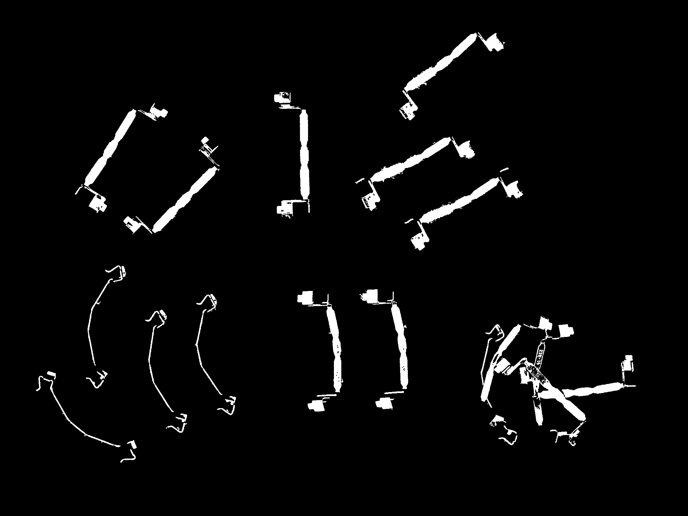
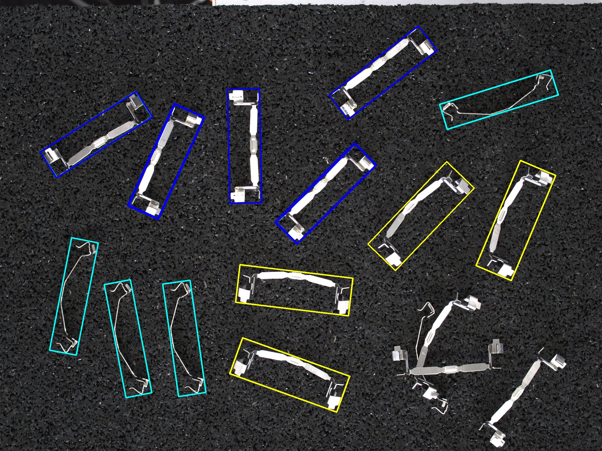

# BBox applyai Vision plugin

## Description
This applyai vision plugin searches for objects in a binary image and allocates a close fitting rotated bounding box around contours within a defined area range.

## Variables
- Minimum area of contour in pixels
- Maximum area of contour in pixels
- Flag to surpress the annotation of the output image

## Returns
- numpy Array listing detected objects
  - plugin name (BBox)
  - center
  - size
  - angle in °
  - area

## Further Information
- [The applyai vision image processing software](../README.md)
- [How to install applyai vision plugins](../plugin-installation.md)
- [Standard applyai vision plugin API description](../plugin-standard-api.md)
- [Authors](../Authors.md)
- [License](../License.md)

