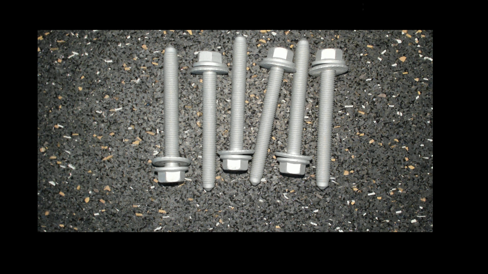

# Capture applyai Vision plugin

## Description
The Capture plugin collects images from any http stream or feed source before further processing.

## Variables
- Url of feed of camera 1 (e.g. http://192.168.178.115:4999/Flir/feed?camera=0)
- Url of feed of camera 2

## Returns
- modified image with (hopefully) isolated objects of interrest

## Further Information
- [The applyai vision image processing software](../README.md)
- [How to install applyai vision plugins](../plugin-installation.md)
- [Standard applyai vision plugin API description](../plugin-standard-api.md)
- [Authors](../Authors.md)
- [License](../License.md)

