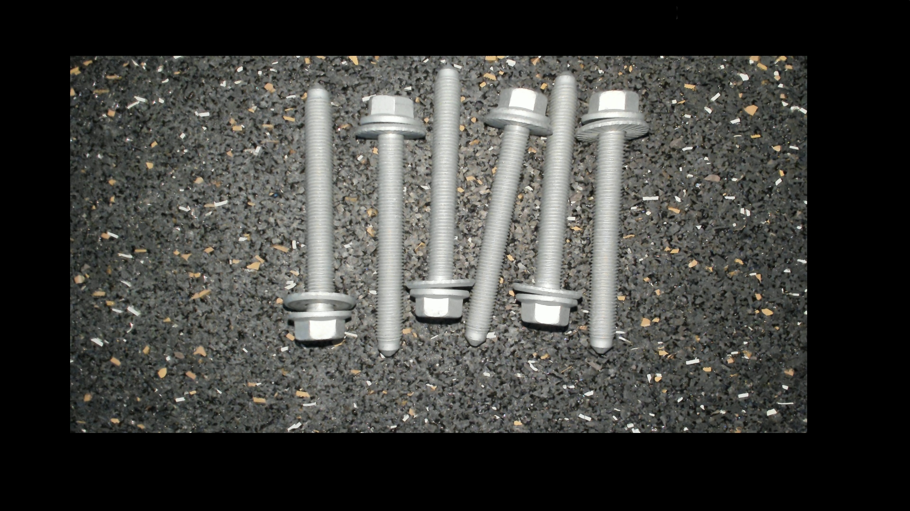

# Capture-applyai Vision-Plugin

</ Div>

## Beschreibung
Das Capture-Plugin sammelt Bilder aus HTTP-Stream oder anderer Quelle vor der Weiterverarbeitung.

## Variablen
- URL Feed von Kamera 1 (z.B. http://192.168.178.115:4999/Flir/feed?camera=0)
- URL Feed von Kamera 2

## Ausgabe
- modifiziertes Bild mit isolierten Objekten

## Weitere Informationen
- [Die applyai Vision Bildverarbeitungs-Software] (../ README.md)
- [Wie applyai Vision Plugins installieren] (../ plugin-installation.md)
- [Standard applyai Vision Plugin API-Beschreibung] (../ plugin-standard-api.md)
- [Autoren] (../ Authors.md)
- [Lizenz] (../ License.md)