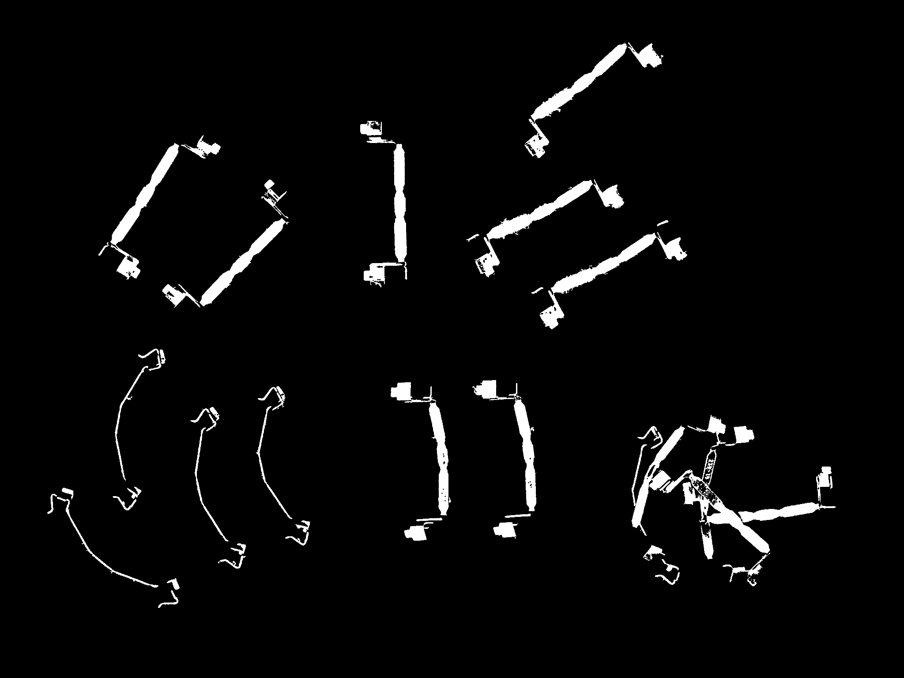
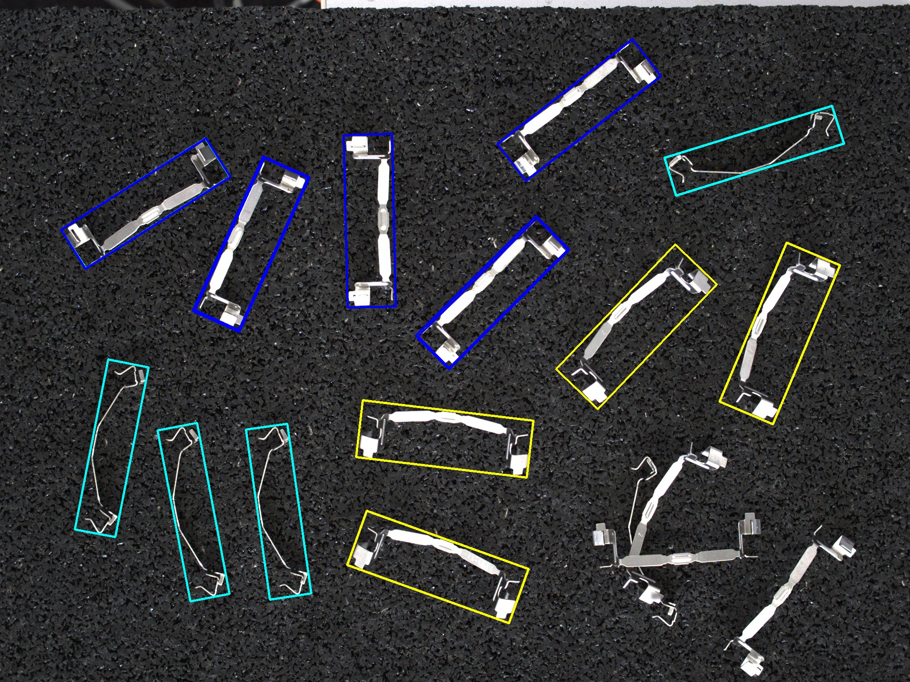

# Classify applyai Vision plugin

## Description
This applyai vision plugin classifies the objects identified. There are many parameters available to enable the classification. These parameters are set by any or all of the preceeding plugins.

Typically these parameters are:
- position (x,y) 
- area (area)
- width and height (w,h)
- angle (angle)
- class as set by the ai model plugin (class)
- any other parameter passed forward by a preceeding plugin
The number of classes is not limited as the default.conf file can be edited to include further definitions for class selection critiera.

## Variables
Example class selection:
- Class 1: h > 250 & w < 100
- Class 2: h > 250 & w > 127
- Class 3: h > 250 & w >= 100 & w <= 127

The following comparisons are supported:
- ==, >, >=, <, <=

The selection can contain numerious concatinated operations

## Returns
- numpy Array listing detected objects
  - plugin name (BBox)
  - center
  - size
  - angle in °
  - area
  - typ (type or class)

## Further Information
- [The applyai vision image processing software](../README.md)
- [How to install applyai vision plugins](../plugin-installation.md)
- [Standard applyai vision plugin API description](../plugin-standard-api.md)
- [Authors](../Authors.md)
- [License](../License.md)

