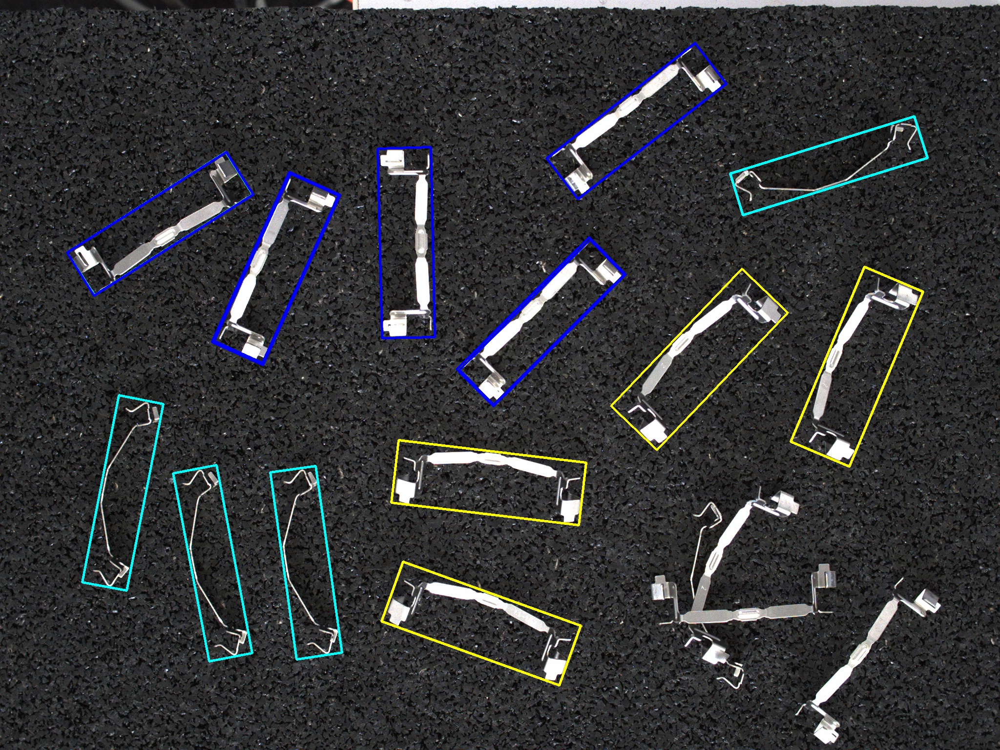

# Classify applyai Vision-Plugin

</ Div>

## Beschreibung
Dieses applyai Vision Plugin klassifiziert die identifizierten Objekte. Es stehen viele Parameter zur Verfügung, die die Klassifizierung ermöglichen. Diese Parameter werden von einigen oder allen der vorhergehenden Plugins gesetzt.

Typischerweise sind diese Parameter:
- Position (x, y)
- Bereich (Bereich)
- Breite und Höhe (w, h)
- Winkel (Winkel)
- Klasse, wie vom ai-Modell-Plugin gesetzt
- jeder Parameter der von vorhergehenden Plugins übergeben wurde
Die Anzahl der Klassen ist nicht begrenzt, da die default.conf Datei so bearbeitet werden kann, dass sie weitere Definitionen für die Klassenauswahl enthält.

## Variablen
Beispielklasse Auswahl:
- Klasse 1: h> 250 & w <100
- Klasse 2: h> 250 & w> 127
- Klasse 3: h> 250 & w> = 100 & w <= 127

Die folgenden Vergleiche werden unterstützt:
- ==,>,> =, <, <=

Die Auswahl kann nummerierte verkettet Operationen enthalten

## Returns
- numpy Array Auflistung der erfassten Objekte
  - Plugin-Namen (BBox)
  - Zentrum
  - Größe
  - Winkel in °
  - Bereich
  - Typ (Typ oder Klasse)

## Weitere Informationen
- [Die applyai Vision Bildverarbeitungs-Software] (../ README.md)
- [Wie applyai Vision Plugins installieren] (../ plugin-installation.md)
- [Standard applyai Vision Plugin API-Beschreibung] (../ plugin-standard-api.md)
- [Autoren] (../ Authors.md)
- [Lizenz] (../ License.md)