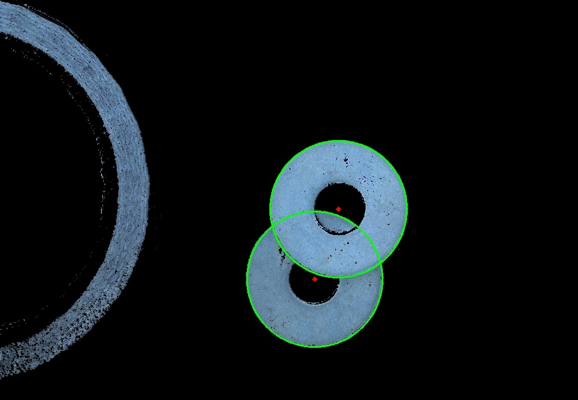

# Color applyai Vision plugin

## Description
The color plugin takes an image and replaces the color range specified with black. It first converts the image to HSV (cv2.COLOR_BGR2HSV) and uses the upper and lower color limits to mask the selected hue (H), saturation (S) and value (V). The remaining image is replaced with black.

## Variables
- HSV color threshold max
- HSV color threshold min

## Returns
- modified image with selected color range removed

## Further Information
- [The applyai vision image processing software](../README.md)
- [How to install applyai vision plugins](../plugin-installation.md)
- [Standard applyai vision plugin API description](../plugin-standard-api.md)
- [Authors](../Authors.md)
- [License](../License.md)

