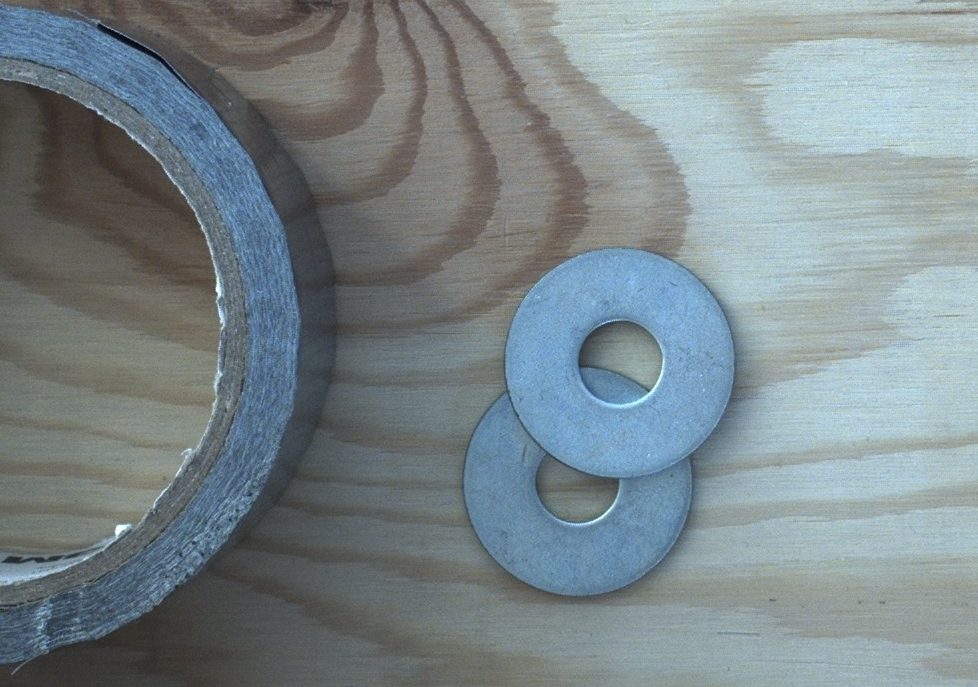
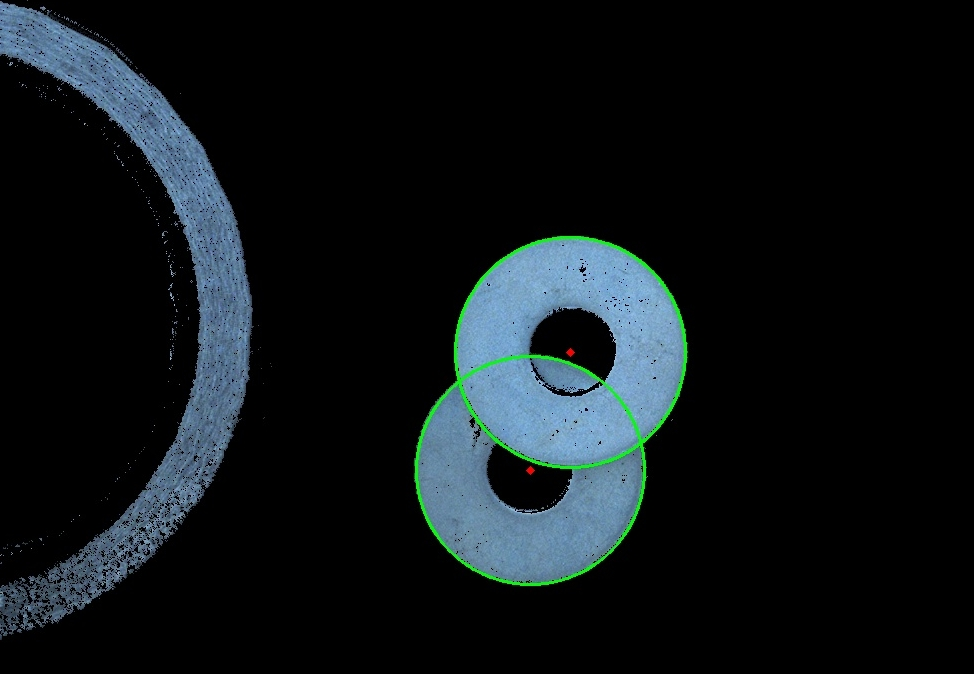

# Farbe applyai Vision-Plugin

</ Div>

## Beschreibung
Das Farb-Plugin nimmt ein Bild auf und ersetzt den angegebenen Farbbereich mit Schwarz. Zunächst wird das Bild in HSV (cv2.COLOR_BGR2HSV) konvertiert und anhand der oberen und unteren Farbgrenze der ausgewählte Farbton (H), die Sättigung (S) und der Wert (V) maskiert. Das verbleibende Bild wird durch Schwarz ersetzt.

## Variablen
- HSV-Farbschwelle max
- HSV-Farbschwelle min

## Ausgabe
- Geändertes Bild mit entferntem ausgewählten Farbbereich

## Weitere Informationen
- [Die applyai Vision Bildverarbeitungs-Software] (../ README.md)
- [Wie applyai Vision Plugins installieren] (../ plugin-installation.md)
- [Standard applyai Vision Plugin API-Beschreibung] (../ plugin-standard-api.md)
- [Autoren] (../ Authors.md)
- [Lizenz] (../ License.md)