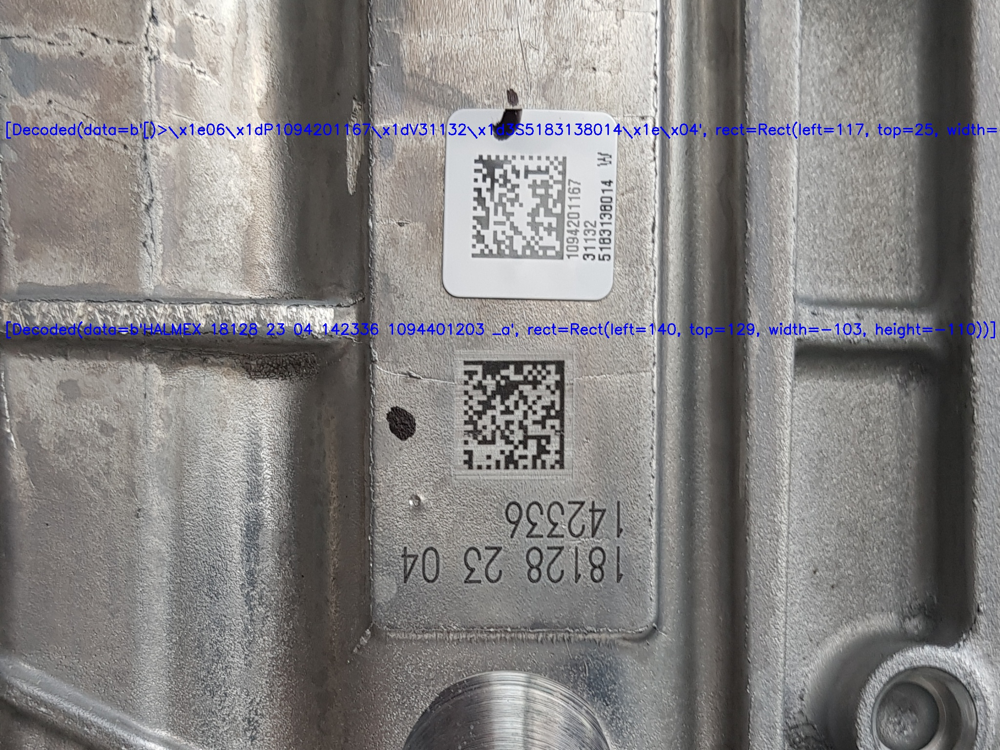

# Datamatrix applyai Vision plugin

## Description
This applyai vision plugin searches for 2D datamatrix codes in images. To speed up the process ROIs can be defined arround the position of the DMC. If required a custom filter can be integrated to remove control codes and other excess information from the code.

## Variables
- none

## Returns
- list of detected objects
  - plugin name (BBox)
  - id of roi
  - x and y of top left hand corner of the dmc
  - size
  - angle in °
  - codes detected

## Further Information
- [The applyai vision image processing software](../README.md)
- [How to install applyai vision plugins](../plugin-installation.md)
- [Standard applyai vision plugin API description](../plugin-standard-api.md)
- [Authors](../Authors.md)
- [License](../License.md)

