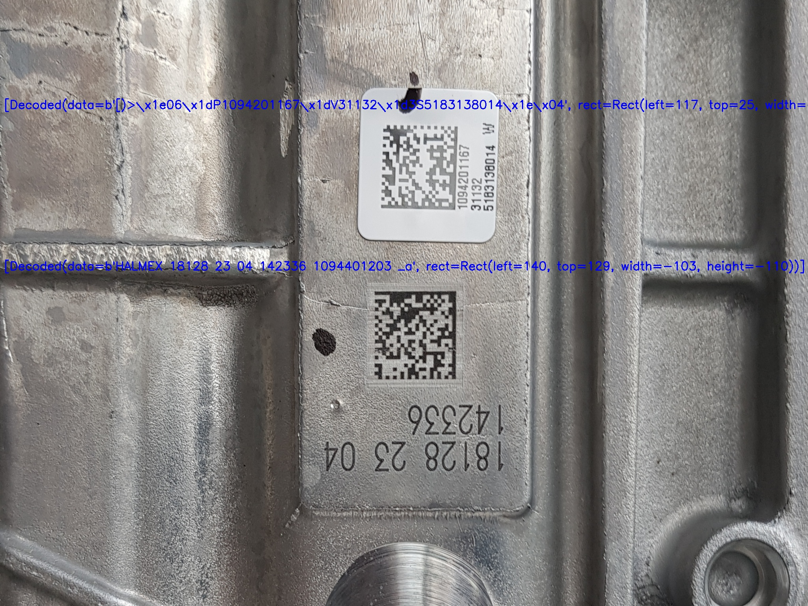

# BBox applyai Vision-Plugin

</ Div>

## Beschreibung
Dieses applyai Vision Plugin sucht nach Objekten in einem binären Bild und ordnet ein nah anliegende gedrehte Box um Konturen innerhalb eines definierten Bereichs.

## Variablen
- Mindestfläche von Kontur in Pixeln
- Maximale Fläche der Kontur in Pixeln
- Flag um Markierungen auf dem Ausgangsbild zu verhindern

## Ausgabe
- numpy Array Auflistung der erfassten Objekte
  - Plugin-Namen (BBox)
  - Zentrum
  - Größe
  - Winkel in °
  - Bereich

## Weitere Informationen
- [Die applyai Vision Bildverarbeitungs-Software] (../ README.md)
- [Wie applyai Vision Plugins installieren] (../ plugin-installation.md)
- [Standard applyai Vision Plugin API-Beschreibung] (../ plugin-standard-api.md)
- [Autoren] (../ Authors.md)
- [Lizenz] (../ License.md)
