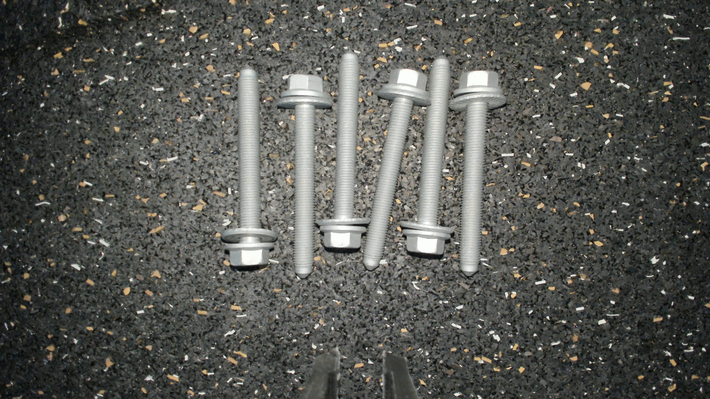

# Lärm applyai Vision-Plugin

</ Div>

## Beschreibung
Dieses applyai Vision Plugin filtert unerwünschtes Bildrauschen.

## Variablen
- Mindestinteressenobjekt in Pixel
- Schwellenwert für die Auswahl von Vordergrund und Hintergrund

## Ausgabe
- modifiziertes Bild mit isolierten Objekten

## Weitere Informationen
- [Die applyai Vision Bildverarbeitungs-Software] (../ README.md)
- [Wie applyai Vision Plugins installieren] (../ plugin-installation.md)
- [Standard applyai Vision Plugin API-Beschreibung] (../ plugin-standard-api.md)
- [Autoren] (../ Authors.md)
- [Lizenz] (../ License.md)