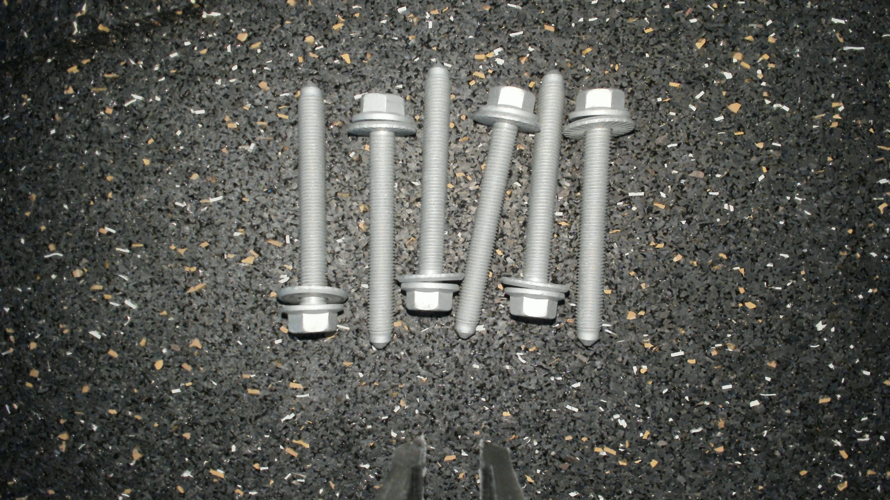

# FillGap applyai Vision-Plugin

</ Div>

## Beschreibung
Das FillGap-Plugin nimmt ein Farbbild auf, konvertiert es in ein Binärbild und extrahiert die Konturen. In einem ersten Bearbeitungsschritt werden die Konturen durch Dilatation (leicht) verstärkt. In einem zweiten Verarbeitungsschritt werden benachbarte Konturen durch ihre nächsten Punkte verbunden, wobei ein Satz von Konturen mit einem erfassbaren Objekt zusammengeführt wird.

## Variablen
- Größe des Kernels
- Keine Iterationen
- Maximale Lückengröße in Pixel gefüllt / überbrückt
- Maximale Anzahl analysierter Konturen vor dem Verlassen des Plugins

## Ausgabe
- modifizierte Bild mit erfolgreich abgeschlossen, aber immer noch isolierten Objekten von interrest

## Weitere Informationen
- [Die applyai Vision Bildverarbeitungs-Software] (../ README.md)
- [Wie applyai Vision Plugins installieren] (../ plugin-installation.md)
- [Standard applyai Vision Plugin API-Beschreibung] (../ plugin-standard-api.md)
- [Autoren] (../ Authors.md)
- [Lizenz] (../ License.md)