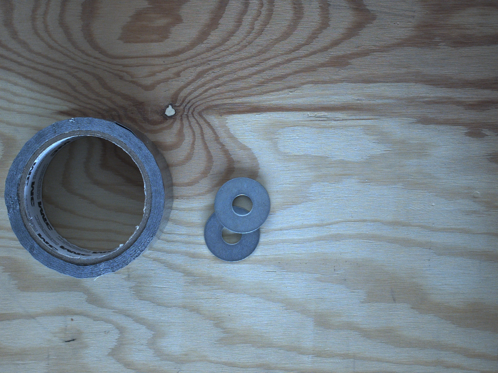
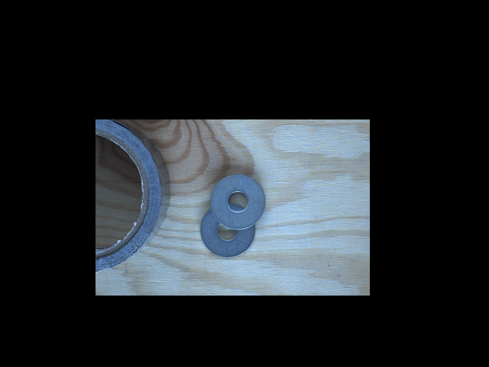

# Mask applyai Vision plugin

## Description
This applyai vision plugin creates a mask arround a rectangular region of interrest (ROI).
Negative values in variable bottom right X and Y are interpreted as relative to the bottom right hand corner of the image. Values outside the dimensions of the input image are ignored.

## Variables
- ROI top left X in pixels
- ROI top left Y in pixels
- ROI bottom right X in pixels
- ROI bottom right Y in pixels

## Returns
- modified image with black outside edges

## Further Information
- [The applyai vision image processing software](../README.md)
- [How to install applyai vision plugins](../plugin-installation.md)
- [Standard applyai vision plugin API description](../plugin-standard-api.md)
- [Authors](../Authors.md)
- [License](../License.md)

