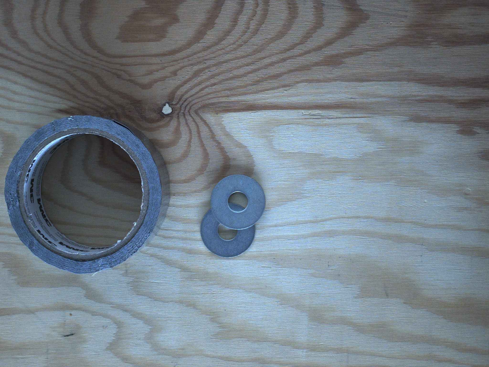

# Mask applyai Vision-Plugin

</ Div>

## Beschreibung
Dieses applyai Vision Plugin erstellt eine Maske um einen rechteckigen Interventionsbereich (ROI).
Negative Werte in den Variablen X und Y unten rechts werden als relativ zur rechten unteren Ecke des Bildes interpretiert. Werte außerhalb der Abmessungen des Eingabebilds werden ignoriert.

## Variablen
- ROI oben links in X Pixel
- ROI Y links oben in Pixel
- ROI unten rechts in X Pixel
- ROI unteren rechten Pixel in Y

## Ausgabe
- modifiziertes Bild mit schwarzen Außenkanten

## Weitere Informationen
- [Die applyai Vision Bildverarbeitungs-Software] (../ README.md)
- [Wie applyai Vision Plugins installieren] (../ plugin-installation.md)
- [Standard applyai Vision Plugin API-Beschreibung] (../ plugin-standard-api.md)
- [Autoren] (../ Authors.md)
- [Lizenz] (../ License.md)