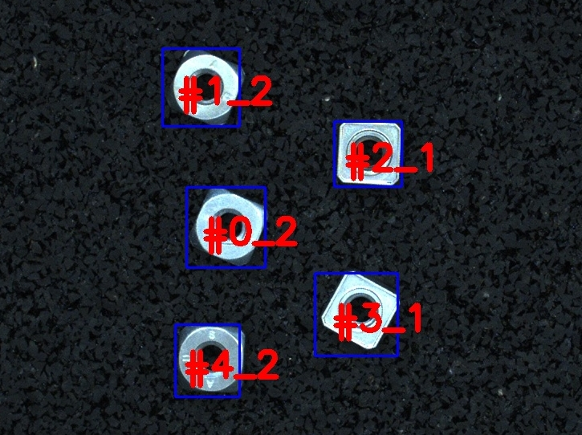

# Model applyai Vision plugin

## Description
The Model plugin takes a color image and uses inference to detect objects of interest. The model used is defined by the input variable 'model name' and can be found in the ../common/frozen_models directory. The model plugin can use inference locally or send a request to a TFX server such as https://aiModelHub.com). Detected objects can be identified in the frameOut image and are numbered for identification. The number corresponds to the number used in the targets dataframe.

## Variables
- Name of the frozen model or name of the tfx model
- Minimum score
- Maximum number of detections
- Hardware used for inference
- Url of the TFX server

## Returns
- modified image with detected objects of interrest

## Further Information
- [The applyai vision image processing software](../README.md)
- [How to install applyai vision plugins](../plugin-installation.md)
- [Standard applyai vision plugin API description](../plugin-standard-api.md)
- [Authors](../Authors.md)
- [License](../License.md)

