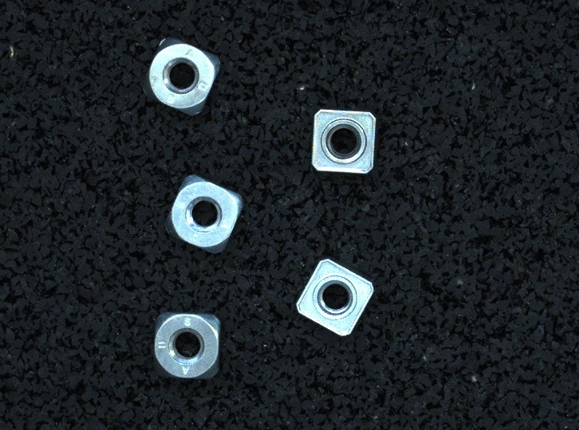
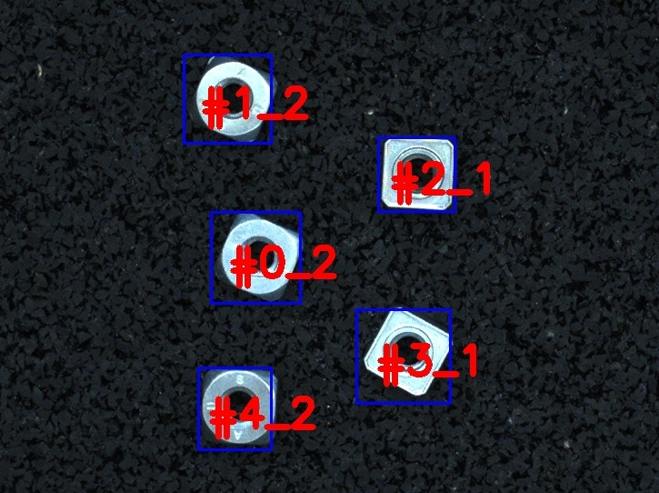

# Modell applyai Vision-Plugin

</ Div>

## Beschreibung
Das Model-Plugin erstellt ein Farbbild und verwendet Inferenz, um Objekte von Interesse zu erkennen. Das verwendete Modell wird durch die Eingabevariable 'Modellname' definiert und befindet sich im Verzeichnis ../common/frozen_models. Das Modell-Plugin kann Inferenz lokal verwenden oder eine Anfrage an einen TFX-Server senden (z. B. https://aiModelHub.com). Erkannte Objekte können im FrameOut-Bild identifiziert und zur Identifizierung nummeriert werden. Die Nummer entspricht der im Zieldatenrahmen verwendeten Nummer.

## Variablen
- Name des eingefrorenen Modells oder Name des tfx-Modells
- Mindestpunktzahl
- Maximale Anzahl von Erkennungen
- Hardware für Rückschlüsse
- URL des TFX-Servers

## Ausgabe
- modifiziertes Bild mit den detektierten Objekten

## Weitere Informationen
- [Die applyai Vision Bildverarbeitungs-Software] (../ README.md)
- [Wie applyai Vision Plugins installieren] (../ plugin-installation.md)
- [Standard applyai Vision Plugin API-Beschreibung] (../ plugin-standard-api.md)
- [Autoren] (../ Authors.md)
- [Lizenz] (../ License.md)