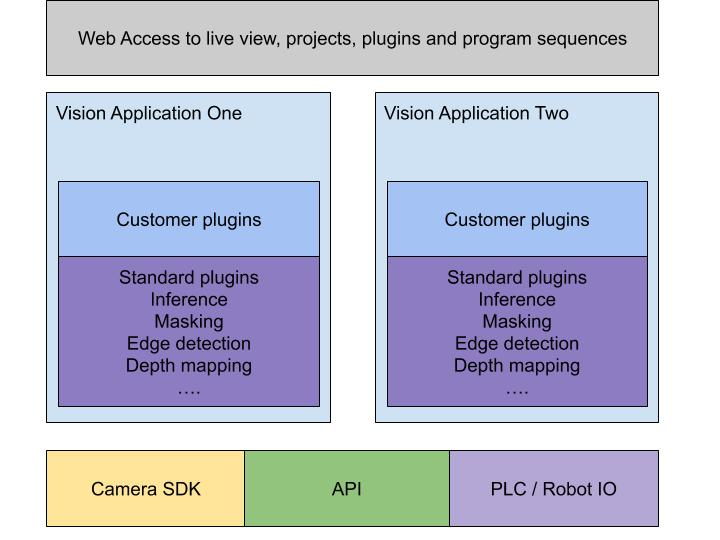

# applyai Vision Plugins

## Description
Applyai Vision plugins are a suite of python modules designed to solve common image processing and object recognition tasks. They are built upon the OpenCV and TensorFlow libraries. They share a common API. Each plugin solves one minor image processing task. When integrated and organised by a supervising application they can be cascaded and combined to create large scale image processing systems. 

- signed - the applyai vision system team

## Further Information
- [How to install applyai vision plugins](./plugin-installation.md)
- [Standard applyai vision plugin API description](./plugin-standard-api.md)
- [Authors](./Authors.md)
- [License](./License.md)

