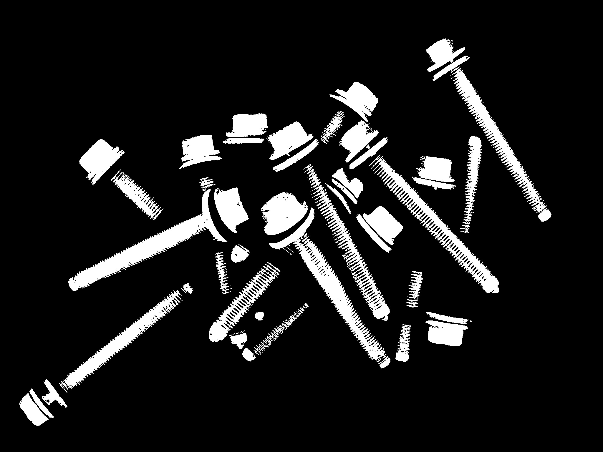
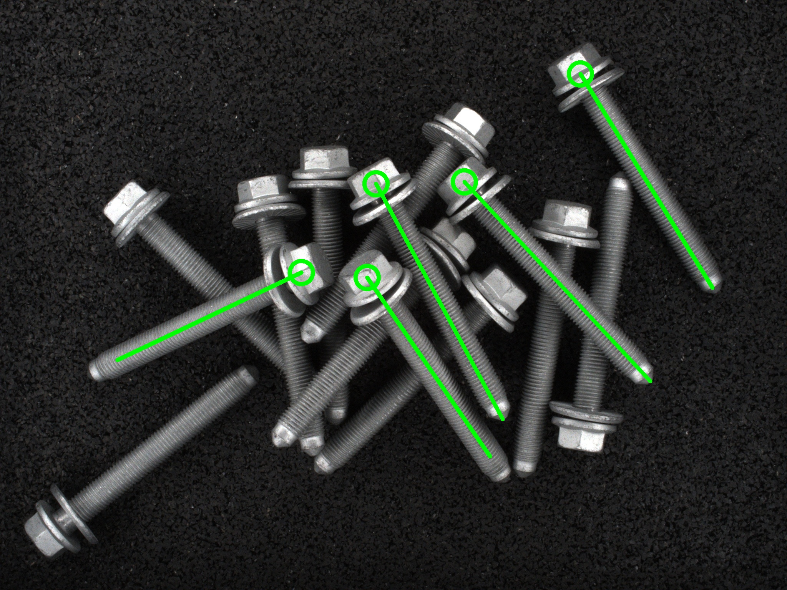

# Screw applyai Vision-Plugin

</ Div>

## Beschreibung
Dieses Applyai Vision Plugin sucht nach Gewinden und Schraubenköpfen in einem Binärbild und erstellt eine Liste. Anschließend werden die Köpfe und Gewinde gepaart, die dann als Schrauben klassifiziert werden. Die Position des Kopfes, die gefundene Schraubenlänge und der Drehwinkel werden gespeichert.

## Variablen
- Die Größe des Kopfes in Pixel
- Mindestlänge des griffigen Gewindes (Schaft) der Schraube

## Ausgabe
- Pandas-Datenrahmen, der erkannte Objekte auflistet
  - Name des Plugins (Schrauben)
  - Mitte des Kopfes
  - sichtbare Länge der Welle / des Gewindes
  - Winkel in °

## Weitere Informationen
- [Die applyai Vision Bildverarbeitungs-Software] (../ README.md)
- [Wie applyai Vision Plugins installieren] (../ plugin-installation.md)
- [Standard applyai Vision Plugin API-Beschreibung] (../ plugin-standard-api.md)
- [Autoren] (../ Authors.md)
- [Lizenz] (../ License.md)
