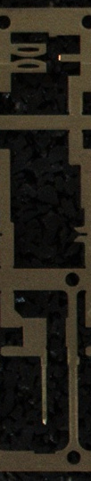
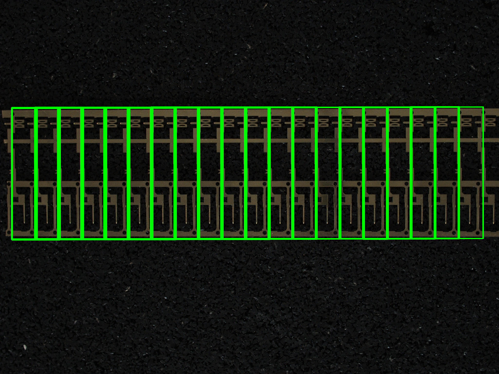

# Mask applyai Vision-Plugin

</ Div>

## Beschreibung
Dieses Applyai Vision Plugin verwendet einen relevanten Referenzbereich, um nach übereinstimmenden Bereichen in einem Bild zu suchen.

## Variablen
- Rechteck oder Referenzbild

## Ausgabe
- modifiziertes Bild mit gefundenen Übereinstimmungen

## Weitere Informationen
- [Die applyai Vision Bildverarbeitungs-Software] (../ README.md)
- [Wie applyai Vision Plugins installieren] (../ plugin-installation.md)
- [Standard applyai Vision Plugin API-Beschreibung] (../ plugin-standard-api.md)
- [Autoren] (../ Authors.md)
- [Lizenz] (../ License.md)